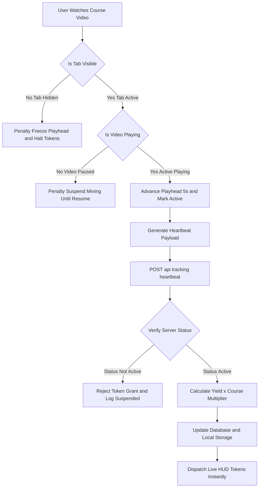

# CourseCade Anti-Cheat Telemetry Engine — System Architecture & Workflow

This document provides the exact architectural breakdown and workflow diagram for explaining the CourseCade Anti-Cheat & Telemetry Verification Engine to engineers, stakeholders, or presentations.

---

## 📊 Excalidraw-Native Flowchart (Ready for Insert)

Excalidraw's Mermaid import tool requires **plain flowchart syntax** without subgraphs, special symbols (`!`, `&`, `•`, emojis), or styling classes (`:::`) for the **Insert** button to work.

Copy and paste this clean block into Excalidraw now—the **Insert** button will work immediately:

---

## 🛡️ The 3 Layers of Defense (Detailed Explanation)

### 1. Frontend Browser Sensor Suite (Real-Time Interception)
* **Tab-Switching / Background Detection (`visibilitychange` & `document.hidden`)**: The moment a user switches tabs or minimizes the browser window, browser API sensors catch the focus loss. Even if state lag occurs, the heartbeat interval explicitly intercepts `document.hidden` before constructing a payload.
* **Playback State Verification (`isPlaying`)**: Prevents idle farming. If the video is paused, the daemon prevents playhead incrementation and flags the stream as paused.
* **Smart Iframe Exception Filtering**: Differentiates between clicking outside the browser (true focus loss) versus clicking inside the embedded YouTube video player (false alarm).

### 2. Heartbeat Telemetry Pipeline (5-Second Pulse)
* Instead of calculating rewards entirely on the client, the browser acts as a telemetry sensor emitting a structured payload every 5 seconds containing the current playhead timestamp and focus signature.

### 3. Backend Verification & Credit Engine (`/api/tracking/heartbeat`)
* **Zero-Trust Credit Evaluation**: The server evaluates the incoming `focusStatus`. If marked as `hidden` or `paused`, zero tokens are minted.
* **Multiplier Scaling**: If active, the server queries the course metadata to apply educational multipliers (e.g. `1.5x` Token Boost for AI mastery courses).
* **Dual-State Synchronicity**: Updates both cloud PostgreSQL storage (`users` table) and local session states simultaneously, ensuring zero discrepancies across sessions.
